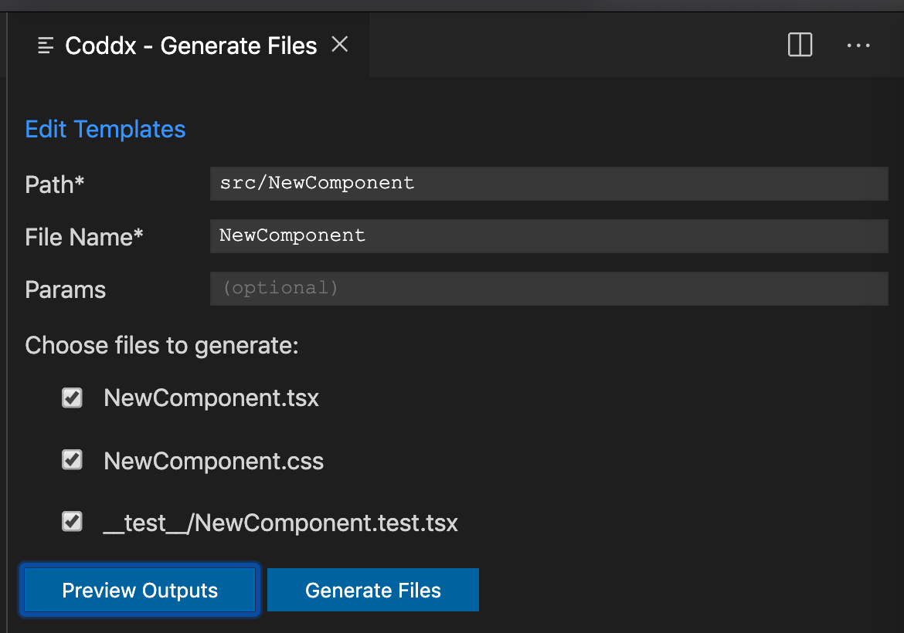

# Coddx

Coddx - a collection of tools that help developers program efficiently.

Some useful features like:

- Task Board - manage tasks and save them as TODO.md - a simple plain text file.
- Generating multiple files from templates quickly.

### Task Board

- Manage tasks with [TODO.md format](https://bit.ly/2JdEuET) - a plain text markdown file.
- The syntax is compatible with [Github Markdown](https://bit.ly/2wBp1Mk)
- TODO.md file is portable and can be committed with Pull Requests (PRs) to git repositories.
- Support custom file name, multiple task lists.
- Checkboxes are optional (if your task titles don't have them).
- See also: <a href="https://bit.ly/2WHprLW">Documentation / Guides</a>

#### Usage:

- Open Coddx Task Board:
  - Bring up the Command Palette (F1), type and select: Coddx: Task Board.
- When interacting with the Task Board, TODO.md will be created or updated automatically.
- Vice versa, TODO.md can be edited manually, Task Board will load it every time (click the Refresh icon).

### Generate Files

- Work with any programming languages.
- Templating syntax.
- Store templates as a single file (can be committed to git, shared with others).
- Auto-create sub-directories.
- Built-in params (fileName, date, time, etc.).
- Custom params.
- Context menu to generate files/directories from anywhere.

#### Usage:

- Open Coddx panel:
  - Bring up the Command Palette (F1), type and select: Coddx: Generate Files.
  - Or: right-click on a directory, select: Generate files.
- Verify Template to suit your needs. (See <a href="https://bit.ly/2WHprLW">Docs</a> for syntax)
- Verify the output path (relative to Project root), a new directory will be created if not existed.
- Enter the new file name to generate file(s).

  

### Support

- Support: https://github.com/coddx-hq/coddx-alpha/issues
- <a href="https://bit.ly/2WHprLW">Documentation / Guides</a>
- <a href="https://bit.ly/2y4fgqh">Change Log</a>

### Next milestone:

- Feedbacks, suggestions or ideas are welcome! Thanks.
