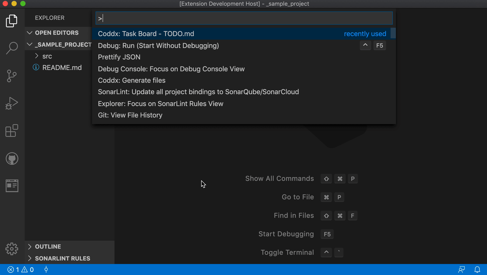
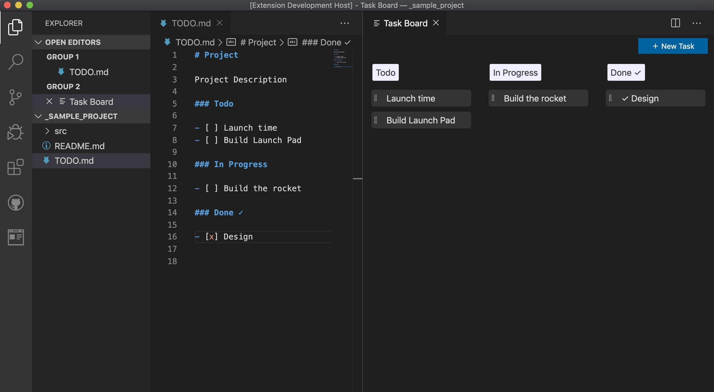

# Todo Kanban Board

Todo Kanban Board manages tasks and save them as [TODO.md](https://bit.ly/2JdEuET) - a simple plain text file.

## Features

- The syntax is compatible with [Github Markdown](https://bit.ly/2wBp1Mk)
- TODO.md file is portable and can be committed with Pull Requests (PRs) to git repositories.
- Support custom file name, multiple task lists.
- Checkboxes are optional (if your task titles don't have them).
- Task title can also have markdown for styling, hyperlinks, simple html or even img tags.
- Task menu: to insert a sub-task, emoji icons (like bug 🐞 blocked ❌ party 🎉 etc.).
- See also: <a href="https://github.com/coddx-hq/coddx-alpha/blob/master/docs/documentation.md">Documentation / Guides</a>

## Usage:

- Open Coddx Task Board:
  - Bring up the Command Palette (F1), type and select: Coddx: Task Board.
- When interacting with the Task Board, TODO.md will be created or updated automatically.
- Vice versa, TODO.md can be edited manually, Task Board will load it every time (click the Refresh icon).

## Support

- For Feedbacks, Bug Reports: https://github.com/coddx-hq/coddx-alpha/issues
- Documentation: <a href="https://github.com/coddx-hq/coddx-alpha/blob/master/docs/documentation.md">Documentation / Guides</a>
- <a href="https://bit.ly/2y4fgqh">CHANGELOG</a>

## Next milestone:

- Feedbacks, suggestions or ideas are welcome! Thanks.
- Check out [TODO.md](TODO.md)
